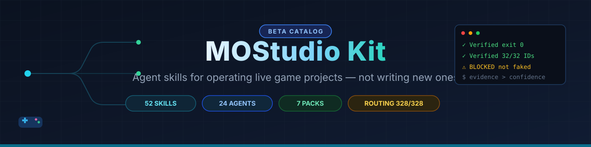
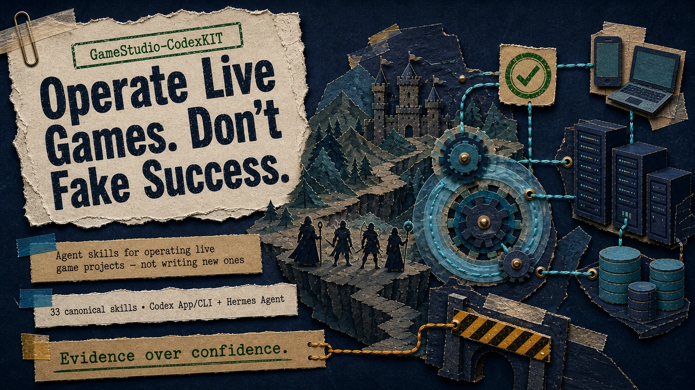
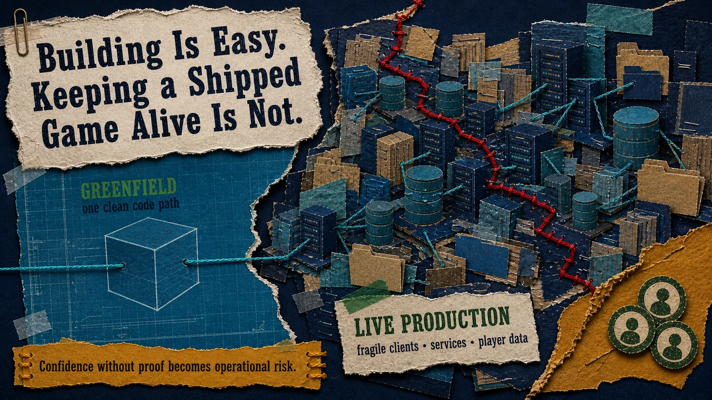
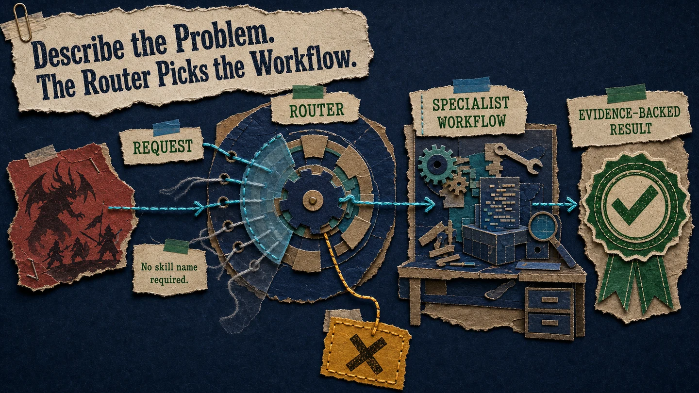
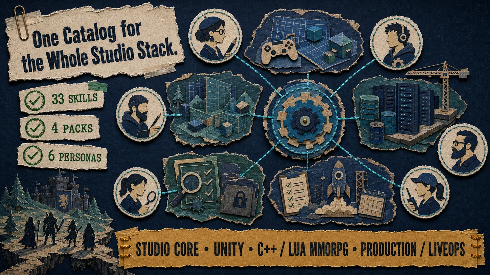
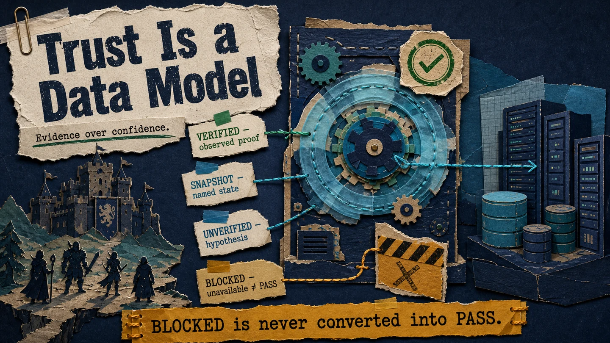
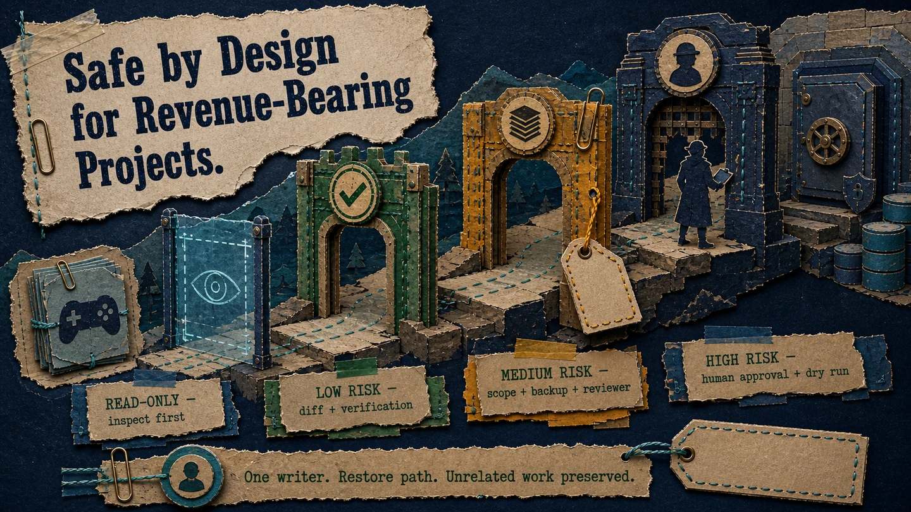
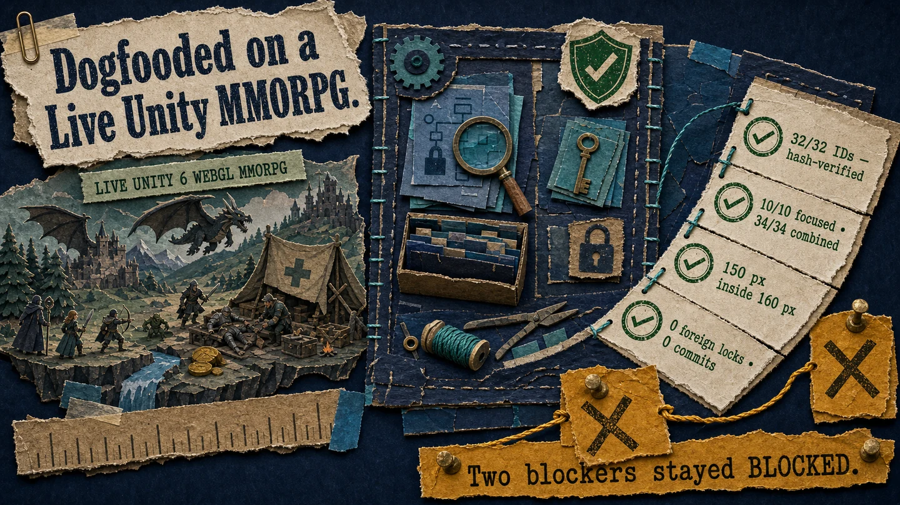
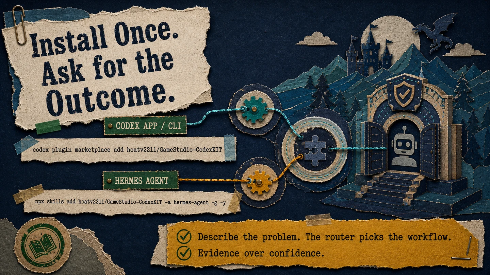

<p align="center">
  
</p>

# MOStudio Kit

**Agent skills for operating live game projects — not writing new ones.**

MOStudio Kit is distributed from the `GameStudio-CodexKIT` repository. Repository URLs, install commands, and the stable plugin ID `game-studio-codex-kit` intentionally keep that technical name.

[](skills/) [](evals/routing/) [](tests/) [](LICENSE)

Most gamedev AI skills teach an agent to *build* games. This kit teaches it to **keep a shipped game alive**: crash triage on a C++ MMORPG server, offline-mode debugging in a legacy Unity client, MySQL migrations that can't eat player saves, Lua client/server contract audits, liveops incidents, store submissions — with an evidence system that makes it structurally hard for the agent to lie about what it did.

```text
you:    "Client can't enter the game offline. Fix it."

agent:  → routes to unity-client-offline-debugging (read-only diagnosis first)
        → traces offline flag through bootstrap, finds stale generated Lua mirror
        → Verified: regenerated via owner pipeline, exit 0, artifact path attached
        → BLOCKED: play-mode re-audit — editor lost mid-run. Not faked as PASS.
```

That last line is the point. Every claim carries one of four labels — `Verified` / `Snapshot` / `Unverified` / `BLOCKED` — and **an unavailable runner is BLOCKED, never PASS**. Your agent's report becomes trustworthy precisely because it is allowed to say "I couldn't verify this."

## Visual tour

The kit connects a live game, its studio stack, and its operating evidence into one routed workflow. No dashboard theater: every page below maps to a real contract in the catalog.

<p align="center">
  
</p>

<table>
  <tr>
    <td width="50%"></td>
    <td width="50%"></td>
  </tr>
  <tr>
    <td align="center"><strong>Built for live production</strong><br><sub>Clients, services, generated assets, and player data stay inside the risk model.</sub></td>
    <td align="center"><strong>Ask for the outcome</strong><br><sub>The router selects the smallest matching specialist workflow.</sub></td>
  </tr>
  <tr>
    <td width="50%"></td>
    <td width="50%"></td>
  </tr>
  <tr>
    <td align="center"><strong>One studio catalog</strong><br><sub>49 canonical skills, seven packs, six thin persona lenses, and 24 canonical agent roles.</sub></td>
    <td align="center"><strong>Trust is explicit state</strong><br><sub><code>BLOCKED</code> is never converted into <code>PASS</code>.</sub></td>
  </tr>
  <tr>
    <td width="50%"></td>
    <td width="50%"></td>
  </tr>
  <tr>
    <td align="center"><strong>Mutation gates scale with risk</strong><br><sub>Diffs, restore paths, reviewers, dry runs, and human approval stay visible.</sub></td>
    <td align="center"><strong>Dogfooded on a live MMORPG</strong><br><sub>Real fixes shipped; missing proof stayed honestly blocked.</sub></td>
  </tr>
</table>

<details>
  <summary><strong>Install paths — Codex App/CLI and Hermes Agent</strong></summary>
  <br>
  <p align="center">
    
  </p>
</details>

## Why this kit is different

| | Typical skill packs | MOStudio Kit |
|---|---|---|
| Target | Writing new code | Operating a live, fragile, revenue-bearing game |
| Failure mode | Agent claims success | `BLOCKED` verdicts + PASS requires command, exit code, artifact |
| Mutations | Agent edits freely | 4-tier risk gates: read-only → low → medium (reviewer+backup) → high (human approval + dry-run) |
| Multi-agent | Single session | One-writer-per-file ownership, lock protocol, handoff contracts, review/bug-hunt swarms |
| Routing quality | Hope the description matches | 305 deterministic eval cases incl. negative + collision cases, bilingual (EN/VI) |

## Field evidence — real run on a live MMORPG

The kit's operating model has been dogfooded on a live Unity 6 WebGL MMORPG client (Lua gameplay layer, workbench localization pipeline, ~10 concurrent agent-session lock namespaces). A skill-routed Codex run reviewed and fixed mixed-Chinese player-facing text with evidence labels on every claim:

| Gate | Result |
|---|---|
| Config-gap batch (32 IDs) | PASS with hash-verified artifacts; catalog `25,609 → 25,641` |
| Sanitizer RED test | GREEN (`10/10` focused, `34/34` combined) |
| Overflow string | Fixed via signature-preserving `%.0s`, edit-mode verified (`150 px` in `160 px`) |
| Strict doctor | `BLOCKED` (stale artifact outside approved lock scope) — not faked |
| Play-mode re-audit | `BLOCKED` (editor instance lost mid-run) — not faked |
| Collateral damage | None: 0 foreign locks touched, 0 commits, unrelated work preserved |

Two runs, three real fixes shipped through owning pipelines, two blockers left standing because the evidence to close them did not exist. The full narrative, including real runner failures and the human approval gate, is in [`docs/case-studies/unity-mmorpg-global-localization.md`](docs/case-studies/unity-mmorpg-global-localization.md).

## Quick install

Choose one primary runtime. A repository clone is not required for normal use.

| Runtime | Install |
|---|---|
| Codex App/CLI | `codex plugin marketplace add hoatv2211/GameStudio-CodexKIT`, then install **MOStudio Kit** from `/plugins` or the App Plugins UI |
| Hermes Agent | `npx skills add hoatv2211/GameStudio-CodexKIT -a hermes-agent -g -y` |

Start a new Codex or Hermes session after installation, then ask for the outcome directly. The root router selects the smallest matching studio workflow.

## What you can ask

No slash commands, no skill names required — describe the problem and the router picks the workflow:

| You say | Routed skill |
|---|---|
| "Audit this game project and route the work to the right studio skills" | `studio-project-intake` (start here on any new repo) |
| "Server crashed, here's the stack trace" | `cpp-server-crash-triage` |
| "Client can't enter offline mode" | `unity-client-offline-debugging` |
| "This UI item doesn't render / wrong draw order" | `unity-ui-rendering-debugging` |
| "Create this Figma HUD, export approved 9-slice assets, and produce a gated uGUI Animator integration plan." | `unity-ui-art-and-motion-production` |
| "I need to change the items table schema" | `game-database-migration-safety` (dry-run gated) |
| "Is this Lua field actually validated server-side?" | `lua-client-server-contract-audit` |
| "Players found a dupe exploit, live incident" | `liveops-incident-response` |
| "Ship-readiness check before the store build" | `release-candidate-preflight` |
| "Write a handoff so the next session can continue" | `studio-handoff` |

Add "evidence labels mandatory" to any request when you want the strict verification contract enforced end-to-end.

## Unity/MMORPG Golden Paths

| Golden Path | Typical canonical workflows |
|---|---|
| Project adoption and routing | `studio-project-intake`, `studio-workspace-routing`, `studio-project-scaffold` |
| Local environment recovery | `multi-service-local-environment-doctor` |
| Unity client entry recovery | `unity-client-offline-debugging` |
| C++ server failure recovery | `cpp-server-crash-triage`, `mmorpg-packet-protocol-review` |
| Unity UI and localization | `unity-ui-rendering-debugging`, `localization-authority-audit` |
| Unity build and asset integrity | `unity-batchmode-build-verification`, `unity-asset-guid-meta-audit` |
| Lua contract and server authority | `lua-client-server-contract-audit`, `network-authority-and-exploit-review` |
| Data and live release safety | `game-database-migration-safety`, `save-data-schema-migration`, `release-candidate-preflight`, `liveops-incident-response` |

Roles (`Developer`, `QA`, `Producer`, `LiveOps`) influence default intent and presentation. Personas remain optional discipline lenses; neither roles nor personas bypass canonical skill safety or evidence contracts.

## Role-first workflow

You do not need to remember skill names. State your studio role and the outcome you need, and the root router maps the request to one of five intents: **Diagnose**, **Verify**, **Plan Change**, **Ship**, or **Handle Incident** across eight Golden Path families. The report-only router returns a planning task packet; only a selected canonical workflow can perform its own work and emit its native artifact, and a normalized evidence card carries the resulting runtime verdict.

| Role and outcome | Example request |
|---|---|
| Developer · Diagnose | "As a Developer, diagnose why this Unity client cannot enter offline mode." |
| QA · Verify | "As QA, verify this local multi-service environment, including server, service, and database context." |
| Producer · Plan Change | "As a Producer, plan repository adoption and show the proposed route without writing files." |
| LiveOps · Handle Incident | "As LiveOps, handle this C++ server crash incident and preserve the build-bound diagnostic evidence." |

Unsupported role, intent, project, or installed-capability combinations return a task-packet `BLOCKED` with no selected workflow, execution, or mutation; the router never turns that planning outcome into a fabricated runtime PASS. The operator may run `studio-project-intake` or select a canonical skill directly outside `gamestudio guide`.

In a full repository clone, the same pure planner is available from the optional terminal adapter:

```text
gamestudio guide [root] --intent <intent>
```

The optional `root` defaults to the current directory. `guide` reads project-profile defaults and detected subsystems, then reports `READY`, `AMBIGUOUS`, or `BLOCKED`; these are planning statuses, never runtime PASS verdicts. `READY` authorizes no execution or mutation. When the top two routes remain ambiguous, the packet asks one focused question. `guide` never executes the selected workflow. Explicit `--workflow` selection requires `--mode advanced` and must name one reported candidate for the selected Golden Path; Basic mode rejects it. Direct selection of a canonical skill remains available outside `gamestudio guide`.

Role defaults are advisory and grant no authority. Basic mode reduces routing controls, while Advanced mode may expose explicit routing controls; neither mode waives evidence, mutation, or approval requirements. Runner-backed behavior remains `BLOCKED` until governed results exist.

## Install in Codex

Add the GitHub marketplace from a terminal:

```bash
codex plugin marketplace add hoatv2211/GameStudio-CodexKIT
codex
```

In the Codex CLI session, enter `/plugins`, select the **MOStudio Kit** marketplace, open **MOStudio Kit**, and install it. Start a new CLI session before using the bundled skills.

In the ChatGPT desktop app, open **Plugins** from Codex, select the **MOStudio Kit** marketplace, install the plugin, and start a new task. Ask for the outcome directly or invoke the plugin with `@game-studio-codex-kit` when you want an explicit route.

Example first request:

```text
Audit this game project and route the work to the right studio skills.
```

Update the marketplace snapshot, then review the plugin in `/plugins` and start a new session:

```bash
codex plugin marketplace upgrade gamestudio-codex-kit
```

To remove it, uninstall the plugin from `/plugins` first, then remove the marketplace:

```bash
codex plugin marketplace remove gamestudio-codex-kit
```

The repository root is the plugin package. `.codex-plugin/plugin.json` exposes the canonical `skills/` directory, while `.claude-plugin/marketplace.json` is the Codex-supported compatibility marketplace discovered from the GitHub repository. Each domain skill carries its own generated helper scripts, so the installed plugin does not depend on the user's current working directory.

## Install in Hermes Agent

Install all 49 skills globally with the Agent Skills CLI:

```bash
npx skills add hoatv2211/GameStudio-CodexKIT -a hermes-agent -g -y
```

Start a new Hermes Agent session after installation. The installer discovers the repository-root `skills/` catalog and copies each skill directory into the Hermes global skills directory. Bundled helpers therefore live inside the skill that uses them. Omit `-g` when you intentionally want a project-local `.hermes/skills/` installation.

To inspect the catalog before installing:

```bash
npx skills add hoatv2211/GameStudio-CodexKIT -a hermes-agent -l
```

Repository governance tools such as the catalog validator, originality audit, and adapter generators are intentionally not copied by Hermes. Clone the repository only when maintaining the kit itself.

## Current state

- 49 canonical skills, including one root entry router and 48 routed workflow or domain skills.
- 305/305 deterministic Tier-A routing cases.
- 10 external-catalog collision cases against six generic neighboring skills.
- 18 governed real-project dogfood scenarios defined with strict PASS/BLOCKED evidence validation.
- Seven installable packs, six thin personas, and 24 canonical agent roles.
- Two primary distributions: native Codex plugin installation and Agent Skills CLI installation for Hermes Agent.
- Eighteen standalone skills with 21 generated helper copies and explicit full-clone boundaries for repository-only governance tools.
- Optional generated exports for manual Hermes, Codex, pack, project-local `.agents/` skills, and `.codex/agents/` role overlays.
- Structural, provenance, secret, network/package, safety, external-catalog collision, behavior, pressure, and lifecycle gates.
- The 49-skill catalog is `beta` as a studio-adopted kit based on maintainer-confirmed use in the FPC project (`Snapshot`); 47 existing skills are beta and `unity-ui-art-and-motion-production` plus `game-screenshot-showcase-and-store-packaging` are `experimental` pending governed dogfood. This does not claim that every skill ran individually. Deterministic gates and the localization case study are `Verified`, while per-skill Tier-B, behavior, pressure, and runtime evidence remain required for `stable`.

The experimental UI production workflow keeps Figma as visual authority and Unity as runtime authority. It uses a design brief/stylecard, prompt lineage, one-variable variants, deterministic static art QC, and reviewed export hashes; it defaults to a report-only plan, never installs tween packages, and cannot claim a runtime PASS without a real Unity project, screenshots, and device evidence.

The template does not claim that a Unity build, C++ server, database migration, store submission, or liveops action has run unless a real project artifact proves it.

## Catalog

| Pack | Focus |
|---|---|
| `studio-core` | Intake, multi-repository routing, agent orchestration, design, planning, debugging, evidence, safe mutation, review, handoff, and skill governance |
| `unity` | Offline client debugging, UI rendering, localization, GUID/meta integrity, and batch builds |
| `cpp-lua-mmorpg` | Local services, MySQL safety, Lua contracts, C++ crashes, packet protocols, authority, and save migration |
| `production-design-liveops` | Playtests, performance, economy, balance, release, stores, incidents, and telemetry |

The authoritative capability list is `registry/capabilities.yaml`. Pack composition and persona routes live in `registry/packs.yaml` and `registry/personas.yaml`. Generated pack artifacts include the transitive skill closure from declared pack dependencies; validation fails when any required capability dependency is unavailable.

## Maintain this repository

A full repository clone exposes an internal maintenance bundle that is intentionally separate from the 49 distributed skills and 24 cataloged agent roles:

- Invoke `codexkit-repository-maintenance` for CI, governance, catalog, generator, adapter, packaging, documentation, architecture, versioning, or release-readiness work on this repository.
- Select the repository-local `codexkit-maintainer` agent when the task needs a bounded writer and integration owner.
- The skill verifies `.codex-plugin/plugin.json`, `registry/capabilities.yaml`, `scripts/validate.py`, and `skills/`; another repository receives `BLOCKED: repository identity mismatch`.
- Internal files live under `.agents/skills/` and `.codex/agents/`. They are excluded from registries, packs, generated adapters, project scaffold templates, and installed game projects.
- Follow `workflows/repository-maintenance.md` and run the local gates below before handoff.

## Contributor requirements

- Python 3.11+
- PyYAML
- jsonschema
- Git

Codex users need a supported Codex surface with plugin marketplace support and Git. Hermes Agent users need Node.js/npm for the `npx skills` installer. Bundled deterministic helpers use Python 3.11+ and may require PyYAML when they validate or render YAML-backed project profiles. A full clone requires PyYAML for repository validation, routing, policy, profile, and generation tools, plus jsonschema for governed dogfood result validation. The project uses standard-library `unittest`; pytest is not required.

## Verify the kit

Run the deterministic local gates before distributing or handing off changes:

```bash
python -B scripts/sync_skill_resources.py . --check
python -B -m unittest discover -s tests -p "test_*.py"
python -B scripts/validate.py .
python -B scripts/route_eval.py .
python -B scripts/secret_scan.py .
python -B scripts/policy_check.py .
python -B scripts/external_collision_eval.py .
python -B scripts/doctor.py --check --root .
```

To compare against an installed Codex/Hermes catalog as well as the checked-in generic snapshot, repeat `--external-root` for each catalog root:

```bash
python -B scripts/external_collision_eval.py . --external-root /path/to/installed/skills
```

Install the managed pre-commit hook:

```bash
python -B scripts/doctor.py --install-hook --root .
```

The hook runs structural validation, Tier-A routing, and secret scanning. It never commits or pushes.
On Linux and macOS, hook installation also marks `.git/hooks/pre-commit` executable; Windows does not expose POSIX execute bits.

## Use in a game project

The commands in this section are maintainer workflows and require a full repository clone. Normal Codex and Hermes installations are prompt-driven and use their installed skill catalogs directly.

Choose one scaffold entry point. Each entry point independently requires equivalent approval gates; the selected entry point must receive a named reviewer, the approved digest from its reviewed report, and a project-local backup root that does not overlap proposed output.

PowerShell report, review, and standalone-script apply:

```powershell
$scaffold = python -B scripts/project_scaffold.py D:/path/to/game-project | ConvertFrom-Json
$scaffold | ConvertTo-Json -Depth 10
```

After reviewing the displayed report, apply that exact plan through the selected entry point:

```powershell
python -B scripts/project_scaffold.py D:/path/to/game-project --apply --reviewer "QA Lead" --backup-root D:/path/to/game-project/.scaffold-backup --plan-digest $scaffold.plan_digest
```

Bash report inspection and digest extraction without `jq`:

```bash
project_root='/path/to/game-project'
report_file="$(mktemp)"
trap 'rm -f "$report_file"' EXIT
python -B scripts/project_scaffold.py "$project_root" > "$report_file"
python -B -m json.tool "$report_file"
plan_digest="$(python -B -c 'import json, pathlib, sys; print(json.loads(pathlib.Path(sys.argv[1]).read_text(encoding="utf-8"))["plan_digest"])' "$report_file")"
test "${#plan_digest}" -eq 64
```

After reviewing the displayed report, apply from the same shell through the selected entry point:

```bash
python -B scripts/project_scaffold.py "$project_root" --apply --reviewer "QA Lead" --backup-root "$project_root/.scaffold-backup" --plan-digest "$plan_digest"
```

The direct API, standalone script, and primary `gamestudio init --apply` path each independently enforce this canonical approval contract; the standalone and CLI adapters forward the selected values to the API. Parity verification covers all three, but operators run only their selected entry point for one plan.

The per-project adapter is report-only by default. Capture its proposed plan first; this command creates nothing:

```powershell
$report = python -B scripts/generate_adapters.py . --target per-project --output D:/path/to/game-project | ConvertFrom-Json
$report | ConvertTo-Json -Depth 10
```

Review the full report and its `plan_digest`, then apply that exact plan. Apply requires a named reviewer, a disjoint project-local backup root, and the approved plan digest:

```powershell
python -B scripts/generate_adapters.py . --target per-project --output D:/path/to/game-project --apply --reviewer "QA Lead" --backup-root D:/path/to/game-project/.adapter-backup --plan-digest $report.plan_digest
```

Apply rebuilds the plan and refuses mutation if the source catalog, project profile, or any managed target changed after the report. If it refuses, generate and review a new report instead of reusing the old digest. The backup root must not overlap any planned target such as `.agents/` or `.codex/`.

The apply command writes kit-owned skills under `.agents/skills/` and builds a role overlay from packaged generic agent templates plus the profile specialist overlay under `.codex/agents/`. It emits an inert activation file at `.codex/agents.generated.toml`, records per-file ownership hashes in `.agents/registry.json`, and returns a safe-mutation manifest plus restore command. The activation file has no effect until it is manually reviewed and merged into project configuration. The adapter leaves `.codex/config.toml` untouched and never overwrites `.codex/config.toml`.

Uninstall is hash-safe: it removes only files whose current content still matches their recorded per-file ownership hash, preserves unmanaged or drifted local agents, and reports `PARTIAL` recovery with the remaining owned paths when safe removal cannot finish. Resolve those paths from the report rather than deleting project-local content blindly.

## Advanced maintenance: packs and adapters

Build all packs:

```bash
python -B scripts/build_packs.py . --output dist/packs
```

Generate standard adapter exports locally from canonical skills when maintaining a manual distribution:

```bash
python -B scripts/generate_adapters.py . --target hermes --output adapters/hermes
python -B scripts/generate_adapters.py . --target codex --output adapters/codex
```

Native Codex and Hermes Agent installation both consume canonical `skills/` and do not require adapter trees. `adapters/` is ignored generated output; its files and generated packs carry a `Do not edit manually` marker. Change `skills/` or `registry/`, then regenerate any export artifacts you intentionally distribute outside this repository.

Bundled skill helpers are also generated. Change the canonical source under root `scripts/`, update `registry/skill-resources.yaml`, and run:

```bash
python -B scripts/sync_skill_resources.py .
```

## Governed evaluation

Tier-A routing is deterministic. Behavior, pressure, and Tier-B routing require result artifacts from a governed runner; skill wording alone is never evidence of correct model behavior.

Export cases and local `BLOCKED` status into the ignored `evidence/local/` workspace:

```bash
python -B scripts/behavior_eval.py . --export evidence/local/behavior-cases.jsonl
python -B scripts/behavior_eval.py . --status evidence/local/behavior-status.json
python -B scripts/pressure_eval.py . --export evidence/local/pressure-cases.jsonl
python -B scripts/pressure_eval.py . --status evidence/local/pressure-status.json
python -B scripts/tier_b_eval.py . --export evidence/local/tier-b-cases.jsonl
python -B scripts/tier_b_eval.py . --status evidence/local/tier-b-status.json
python -B scripts/dogfood_eval.py . --export evidence/local/dogfood-cases.jsonl
python -B scripts/dogfood_eval.py . --status evidence/local/dogfood-status.json
python -B scripts/studio_adoption_eval.py . --export evidence/local/studio-adoption-cases.jsonl
python -B scripts/studio_adoption_eval.py . --status evidence/local/studio-adoption-status.json
python -B scripts/studio_adoption_eval.py . --results evidence/local/studio-adoption-results.json
```

The dogfood pack contains fifteen real-project scenarios covering Unity offline/bootstrap and NGUI rendering, batchmode builds, MySQL safety, local service ports, C++ crashes, Lua contracts, liveops incidents, release preflight, project intake, workspace routing, agent orchestration, GUID/meta integrity, server-authority boundaries, and save-schema rollback. Supply governed results with `--results`; missing Hermes/live-project execution remains `BLOCKED`.

Studio adoption PASS requires at least 80% intended Golden Path routing, no run above three questions, install-to-first-use at or below five minutes, zero missing-dependency failures, zero unauthorized writes, PASS task verdicts, and repository-contained SHA-256-bound artifacts. Without governed results, the adoption evaluator returns `BLOCKED` with unobserved metrics left `null`.

After a governed runner produces the strict `{"results": [...]}` object and stores hashed artifacts under an approved root, validate it and generate promotion-eligible summaries:

```bash
python -B scripts/dogfood_eval.py . --results evidence/local/dogfood-results.json --artifact-root evidence/local --summary-dir evidence/local/dogfood
```

The evaluator rejects bare PASS labels, schema drift, unsafe or missing artifact paths, digest mismatches, non-zero exits, missing reviewers or project snapshots, unauthorized writes, and incomplete case coverage. Legacy array results remain diagnostic-only and cannot generate promotion summaries. See `docs/authoring/dogfood.md` for the runner contract.

When a runner, live project, engine, service, or permission is unavailable, the correct verdict is `BLOCKED`, never a fabricated PASS.

`scripts/check_originality.py` is also `BLOCKED` until the upstream snapshots in `registry/upstream-sources.yaml` are restored or supplied explicitly.

## Evidence labels

- `Verified`: observed command, test, build, primary source, or artifact.
- `Snapshot`: true for a named commit, version, configuration, or environment.
- `Unverified`: hypothesis or forecast without sufficient evidence.
- `BLOCKED`: required runner, project, dependency, permission, or tool is unavailable.

A PASS claim includes the command, exit code, and artifact path when applicable.

## Repository layout

```text
 .codex-plugin/ native Codex plugin manifest
 .claude-plugin/ GitHub marketplace metadata read by Codex
skills/       canonical workflows plus generated self-contained helper copies
registry/     capability, pack, persona, skill-resource, and upstream indexes
personas/     thin role lenses and routes
workflows/    human-facing entry workflows
scripts/      deterministic helpers, generators, and gates
tests/        unittest regression and governance coverage
evals/        routing, external-catalog, dogfood, behavior, pressure, and schema fixtures
adapters/     ignored local Hermes and Codex export output
evidence/     reusable example; local runner output is ignored
.archive/     ignored local planning history, never distributed or active policy
```

Architecture details live in `docs/architecture/overview.md`; skill authoring rules live in `docs/authoring/skills.md`; operating rules live in `AGENTS.md`.

## Local archive boundary

`.archive/` is ignored local history for completed plans or cleanup notes that an individual maintainer wants to retain. It is not part of the public template, plugin, adapters, or packs, and agents must never treat it as current instructions. Durable project decisions belong in maintained docs; reproducible runtime evidence belongs in `evidence/local/` or CI artifacts.

## Contributing skills

Use update-first authoring:

1. Search the registry for overlap.
2. Add a failing routing, behavior, pressure, or deterministic regression case.
3. Update the smallest canonical skill and provenance record.
4. Update `registry/skill-resources.yaml` and regenerate bundled helpers when a skill uses a root helper.
5. Run all local gates.
6. Validate the native plugin and regenerate any packs or adapters being distributed.
7. Keep new skills `draft` or `experimental` until studio adoption is confirmed; use `beta` for adopted workflows, and require governed promotion evidence for `stable` or `release`.

## License

MIT. Third-party influence is recorded through per-skill provenance. CC BY-NC-SA sources are pattern-only and must not be copied into the kit.
